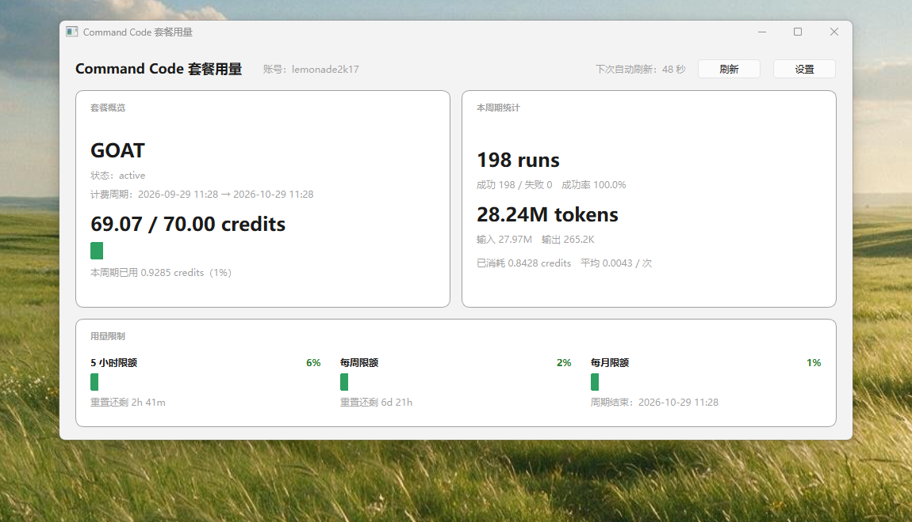
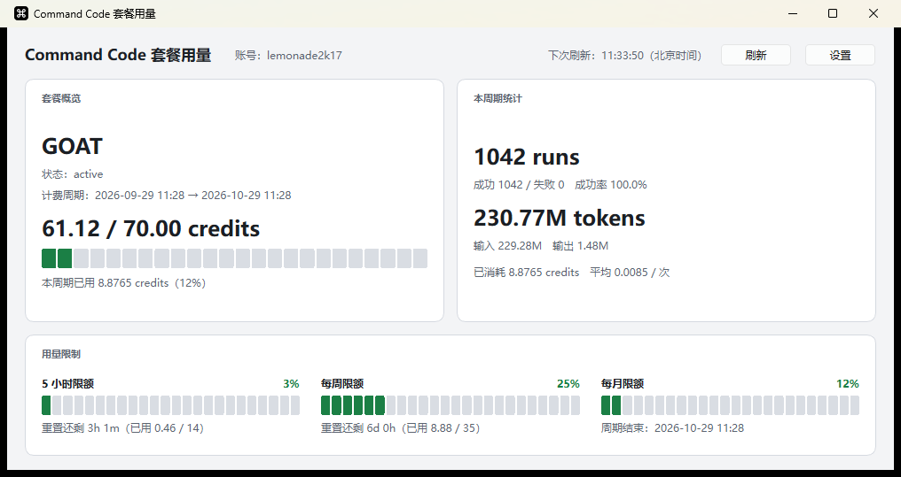
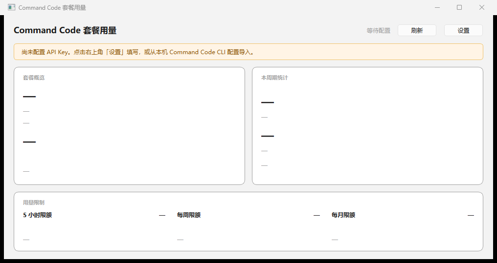
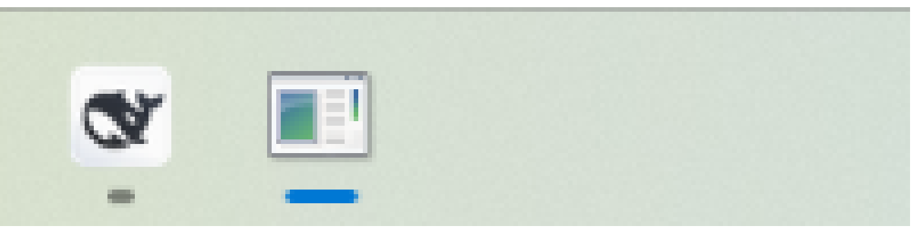

# Command Code 套餐用量查看器

一个 Windows 桌面小工具，用 Qt 6.11.2 编写，用于查看 [Command Code](https://commandcode.ai) 账号的套餐额度与用量限制。

- **API Key 默认留空**，由使用者在界面里自行配置，不硬编码任何凭据。
- **只支持静态链接**构建：产出单文件 exe，不依赖任何 `Qt6*.dll`，也不依赖 `libstdc++-6`/`libgcc_s_seh-1`/`libwinpthread-1`。
- 内置**浅色 / 深色 / 跟随系统**三档主题，应用图标取自 Command Code 官方标志。

## 界面

正常读取数据后（浅色主题）：



深色主题（在「设置 → 外观主题」中切换，也可跟随系统）：



首次运行（API Key 默认留空，提示去「设置」填写）：



主窗口分三块，与官网 "USAGE LIMITS" 页面同口径：

| 卡片 | 内容 |
|---|---|
| 套餐概览 | 套餐名（Go/GOAT/Pro/Max/Ultra…）、订阅状态、计费周期、剩余/总额 credits 与进度条 |
| 本周期统计 | 请求次数（runs）、成功/失败、token 输入输出、已消耗 credits、平均单次成本 |
| 用量限制 | **5 小时限额** / **每周限额** / **每月限额** 三条分段进度条 + 重置倒计时 |

右上角为「刷新」「设置」按钮，状态栏显示最后更新时间与下次自动刷新的时刻（北京时间，每次刷新后随之更新）。

## 桌面集成（通知区域 / 任务栏）

把用量"缩到窗口之外"，四项全部可在「设置 → 桌面集成（缩略信息）」里**独立开关**：

| 能力 | 说明 | 默认 |
|---|---|---|
| 通知区域（托盘）图标 | 图标内动态绘制所选指标的缩略数字（如 `29%`），底色按占用率变绿 / 琥珀 / 红；悬停显示套餐、剩余额度、指标明细、最后更新时间 | 开启 |
| 任务栏按钮缩略信息 | **进度条与彩色角标共用一个开关**：`ITaskbarList3::SetProgressValue` 在按钮上显示占用率，`SetOverlayIcon` 另在右下角叠加彩底数字 | 开启 |
| 关闭窗口时最小化到托盘 | 勾选后点关闭只隐藏窗口，需从托盘菜单「退出」才结束进程 | 关闭 |

任务栏按钮放大（下方的蓝色进度条与右下角的绿色圆角角标，分别为 `SetProgressValue` 与 `SetOverlayIcon` 的结果；角标底色把白字完整包住）：



托盘右键菜单：**显示主窗口 / 立即刷新 / 设置… / 退出**；双击托盘图标亦可唤出窗口。

托盘图标实拍（自动提升后出现在任务栏**可见区**，紧跟溢出箭头 `^` 之后的第一个位置；绿色 `45%` 即 5 小时限额占用率，点 X 关窗后图标仍驻留）：


### ⚠️ 找不到托盘图标时怎么办（重要）

Windows 11 会把新托盘图标收进**溢出区**（任务栏上的 `^`）。如果你勾选了「关闭窗口时最小化到托盘」，
点 X 之后窗口会消失、进程仍在后台；万一又找不到托盘图标，程序仍留有两条**逃生通道**：

| 逃生方式 | 做法 | 效果 |
|---|---|---|
| 再运行一次本程序 | 双击 exe / 再次执行命令行启动 | 第二个实例把"显示窗口"命令发给已在运行的实例后**立即退出**（实测 0.16 秒），已有实例的窗口被唤回前台 |
| 命令行退出 | `<程序路径> --quit` | 立即结束后台进程（无实例在运行时也返回 0） |

程序以**单实例**方式运行（本地套接字 `CommandCodeUsageMonitor-<用户名>`），因此重复启动**不会**开出第二个窗口。
「设置 → 桌面集成」里也写明了上述两条退路，避免出现"关不掉又找不回"的状态。

「显示内容」可选：5 小时限额占用率 / 每周限额占用率 / 每月额度占用率 / 剩余额度数值。
百分比口径与主界面、官网完全一致（`floor(used / cap × 100)`）。

### 两个平台注意事项

1. **Windows 11 默认会把新的托盘图标收进溢出区**（任务栏上的 `^`）。程序在启用托盘时会**自动尝试把图标提升到任务栏可见区**：写注册表 `HKCU\Control Panel\NotifyIconSettings` 中本程序条目的 `IsPromoted=1`（等效于你在系统设置里打开该开关），并让外壳重新注册图标。若外壳尚未登记本程序的图标（例如图标注册失败时），提升会静默跳过，此时可手动拖动，或到「设置 → 个性化 → 任务栏 → 其他系统托盘图标」里打开本程序。**找不到图标时的自救办法见上文「找不到托盘图标时怎么办」。**
2. **任务栏角标有权限门槛（根因已定位并修复）**：`SetOverlayIcon` 要求进程完整性级别不低于任务栏，否则返回 `E_ACCESSDENIED (0x80070005)`。本项目开发目录被会话沙箱打了**低完整性**强制标签并被 exe 继承，Windows 按映像文件的标签降权启动进程——即使从资源管理器双击，进程也是低完整性，进而导致：任务栏角标被拒、托盘图标注册不可靠、Qt 把配置目录重定向到 LocalLow。**修复**：`scripts/build-static.ps1` 在每次构建的最后用 `icacls /setintegritylevel M` 给 exe 打上显式的 Medium 标签（显式标签优先于继承标签；重新链接会重新继承目录标签，因此每次构建都必须重打）。实测对比：修复前 `processIntegrity = Low (0x1000)` + `taskbarBadgeHresult = 0x80070005`；修复后 `processIntegrity = Medium (0x2000)` + `taskbarBadgeHresult = 0x00000000` + `taskbarProgressApplied / taskbarBadgeApplied = yes`。若重新构建后角标仍不显示，请先看 `--probe-ui` 输出里的 `processIntegrity` 是否为 `Medium (0x2000)`。

### 运行时自检

```powershell
.\build-static\commandcode-usage.exe --probe-ui 12 --out probe.txt
```

它会真正显示界面、等待若干秒后把桌面集成状态落盘（`trayVisible`、`taskbarAttached`、
`taskbarProgressApplied`、`taskbarBadgeApplied`、`taskbarBadgeHresult` 等），
用于把"功能没生效"与"系统不支持/无权限"区分开。

## 数据来源

全部来自 Command Code 官方服务端的四个接口（`Authorization: Bearer <apiKey>`）：

| 接口 | 用途 | 关键字段 |
|---|---|---|
| `GET /alpha/whoami?limits=1` | 账号信息 | `user.userName`、`user.email`、`org.id` |
| `GET /alpha/billing/credits` | 额度与限流窗口 | `credits.monthlyCredits`（本周期**剩余**）、`windowLimits.fiveHour{used,cap,resetAt}`、`windowLimits.weekly{...}` |
| `GET /alpha/billing/subscriptions` | 套餐与周期 | `data.planId`、`data.status`、`data.currentPeriodStart/End` |
| `GET /alpha/usage/summary?since=<ISO8601>` | 区间统计 | `totalCount`、`totalTokensIn/Out`、`totalCost`、`totalCredits` |

几个容易踩的坑（本工具已按此处理）：

1. `credits.monthlyCredits` 是**剩余**而不是已用；已用 = 套餐总额 − 剩余。套餐总额来自 CLI 内置映射表：
   `Go=10`、`GOAT=70`、`Pro=30`、`Pro(旧)=80`、`Provider=15`、`Max=150`、`Ultra=300`、`Teams Pro=40`。
2. 百分比与官网一致，采用**向下取整**：`pct = floor(used / cap × 100)`。分母分别是 5 小时窗口上限、每周窗口上限、套餐总额。
3. 第三个窗口官网叫 "MONTHLY LIMIT"，但它的锚点是**订阅计费周期**（通常是 1 个月，由 `currentPeriodEnd` 决定），不是自然月。
4. `/alpha/*` 属于**未公开的内部接口**，随 CLI 版本可能调整；字段缺失时本工具会显示 `—` 并在底部提示错误，而不是崩溃。
5. `usage/summary` 的 `totalCost` 与 `windowLimits.*.used` 之间可能有小幅滞后差异（在途/未结算请求），属正常现象。

## 配置

配置保存在 **Roaming**（`QStandardPaths::AppDataLocation`；该档位在 Qt 的 Windows 实现里对中、低完整性进程都映射到同一个 `%APPDATA%` 目录，配置位置不随启动方式漂移）：

```
%APPDATA%\CommandCodeUsageMonitor\CommandCodeUsageMonitor\settings.ini
```

> **迁移说明**：早期版本把配置放在 `%USERPROFILE%\AppData\LocalLow\...`（Qt 在低完整性
> 进程里会把 `AppConfigLocation` 重定向到 LocalLow）。新版本首次启动时若发现新位置
> 没有配置而旧位置存在，会把旧配置**整体复制**过来（含 API Key）；旧文件保留不删，
> 确认无误后可手动清理。

不确定时可以直接问程序本身，它会打印实际路径：

```powershell
.\build-static\commandcode-usage.exe --selftest
# SELFTEST: configFile = C:\Users\<你>\AppData\Roaming\...\settings.ini (exists=yes)
```

| 键 | 说明 | 默认值 |
|---|---|---|
| `api/key` | API Key，**默认为空** | 空 |
| `api/baseUrl` | API 地址 | `https://api.commandcode.ai` |
| `ui/refreshSeconds` | 自动刷新间隔（秒），0 = 关闭 | `60` |
| `ui/theme` | 外观主题：`light` / `dark` / `system` | `system`（跟随系统） |
| `ui/statusMetric` | 托盘图标与角标显示的指标：`fiveHour` / `weekly` / `monthly` / `remaining` | `fiveHour` |
| `ui/trayEnabled` | 是否显示托盘图标 | `true` |
| `ui/taskbarBadgeEnabled` | 是否显示任务栏进度条与角标 | `true` |
| `ui/closeToTray` | 关闭窗口时是否隐藏到托盘 | `false` |

在「设置」里还可以点 **从 CLI 导入**，显式读取本机 `~/.commandcode/auth.json` 里的 `apiKey`（只有点击时才读取，不会自动读取）。

> API Key 只保存在本机 `settings.ini`，不会发送到除 `api.baseUrl` 之外的任何地方。

## 构建

### 依赖

- **静态** Qt **6.11.2**（`Core` / `Gui` / `Widgets` / `Network`；自建于 `D:\qt-static\install`，
  由 `scripts\build-static-qt.ps1` 生成。Qt 官方安装器只提供共享版，不能用于本工程）
- CMake ≥ 3.22、Ninja、MinGW-w64 GCC ≥ 11

### 静态链接构建（单文件 exe）

本工程**只支持静态链接**：Qt 官方安装器提供的都是共享版（`qconfig.pri` 里 `static` 属于
disabled features），因此必须先自己从源码编译一份静态 Qt（仅 `qtbase` 即可，包含
Core/Gui/Widgets/Network）。CMake 配置阶段会检查 Qt 前缀：若发现 `bin/Qt6Core.dll`
（共享版）会**直接报错终止**，杜绝误产出动态链接产物。

```powershell
.\scripts\build-static-qt.ps1        # 约 45~90 分钟（4 核），产出 D:\qt-static\install
.\scripts\build-static.ps1           # 用静态 Qt 构建本项目，产出 build-static\commandcode-usage.exe
```

关键配置项（脚本已内置，实测生效）：

```
BUILD_SHARED_LIBS=OFF            # 静态
QT_FEATURE_schannel=ON           # Windows 原生 TLS，无需 OpenSSL
QT_FEATURE_openssl=OFF
system zlib/png/jpeg/freetype/harfbuzz/pcre2 = no   # 全部用 Qt 自带，避免引入外部 DLL
```

链接阶段附加 `-static -static-libgcc -static-libstdc++ -s`，消除 `libstdc++-6.dll`、`libgcc_s_seh-1.dll`、`libwinpthread-1.dll` 依赖。

验证静态产物是否真的"单文件"：

```powershell
objdump -p build-static\commandcode-usage.exe | Select-String 'DLL Name'
```

导入表里应**只有** `KERNEL32.dll`、`msvcrt.dll`、`SHELL32.dll` 等系统 DLL，**不应出现任何 `Qt6*.dll`**。

### 本机实测结果

| 项目 | 结果 |
|---|---|
| 产物 | `build-static\commandcode-usage.exe`（工程唯一产物，不再产出动态链接版本） |
| 体积 | 约 **28.4 MB** |
| 依赖 DLL | **仅系统 DLL**（导入表 37 条：`KERNEL32`/`USER32`/`SHELL32`/`ole32` 等；无任何 `Qt6*.dll`，也无 `libstdc++/libgcc/winpthread` 与 zlib/png/jpeg/freetype 外部库） |
| 分发 | 单文件直接分发：无需 windeployqt，也不受 PATH 上其它软件自带 Qt 的影响 |

静态 Qt 构建耗时：`i7-1165G7`（4 核 8 线程，`ninja -j6`）约 **50 分钟**（含 configure 约 2.5 分钟、编译 1850 个目标、安装）。

静态版自检输出（`--selftest`，含 HTTPS 走静态 Schannel 的实证；下列为某次运行的快照，数值随用量变化）：

> 可复现留痕：`.\build-static\commandcode-usage.exe --selftest --out docs\selftest-static.txt`
> （该文件含账号名等个人信息，已被 `.gitignore` 忽略，不会进入版本库）

```
SELFTEST: Qt = 6.11.2
SELFTEST: build = STATIC (QT_STATIC)
whoami:  lemonade2k17
plan:    individual-goat / active / total=70 credits
period:  2026-09-29 11:28  ->  2026-10-29 11:28
credits: remaining=69.3562  used=0.6438  pct=0.92%
5h:      used=0.6438 cap=14 pct=4% reset=09-29 16:35
weekly:  used=0.6438 cap=35 pct=1% reset=10-06 11:35
summary: runs=159  tokens=18549004 (in=18329259 out=219745)  cost=0.627701
SELFTEST OK
```

## 命令行参数

```
commandcode-usage.exe [--selftest] [--key <key>] [--base-url <url>] [--out <file>]
```

| 参数 | 说明 |
|---|---|
| 无参数 | 打开图形界面 |
| `--selftest` | 无界面自检：调用四个接口并打印结果后退出（exit 0 = 全部成功） |
| `--key` | 临时指定 API Key，**只对本次运行生效，不写入配置** |
| `--base-url` | 临时指定 API 地址 |
| `--out` | 把自检输出同时写入文件（便于脚本采集） |
| `--probe-ui <秒>` | 启动界面、等待指定秒数（默认 8）后输出桌面集成状态并退出，用于验证托盘/任务栏是否真的生效 |
| `--quit` | 请求已在运行的实例退出；没有实例在运行时直接返回 0。用于清掉"窗口已隐藏、又找不到托盘图标"的后台进程 |

自检示例：

```powershell
.\build-static\commandcode-usage.exe --selftest --key user_xxx --out selftest.txt
```

## 目录结构

```
CommandCodeUsageMonitor/
├── CMakeLists.txt
├── README.md
├── .gitignore
├── resources/
│   ├── app.ico               # 应用图标（256/48/32/16 四尺寸，来源见下）
│   └── app.rc                # 资源脚本：把 app.ico 编进 exe（MinGW 由 windres 处理）
├── scripts/
│   ├── build-static-qt.ps1    # 从源码构建静态 Qt（一次性，约 45~90 分钟）
│   └── build-static.ps1       # 用静态 Qt 构建本项目（唯一构建入口）
└── src/
    ├── main.cpp               # 入口 + 自检模式
    ├── AppConfig.h/.cpp       # 配置读写（QSettings INI）
    ├── AppTheme.h/.cpp        # 浅色 / 深色 / 跟随系统 三档主题
    ├── UsageTypes.h           # 数据结构 + 套餐目录
    ├── CommandCodeApi.h/.cpp  # 四个接口的客户端
    ├── SegmentedBar.h/.cpp    # 分段进度条控件
    ├── SettingsDialog.h/.cpp  # 设置对话框
    ├── TrayController.h/.cpp  # 通知区域图标（含 Win11 溢出区自动提升）
    ├── TaskbarProgress.h/.cpp # 任务栏进度条与角标（ITaskbarList3 封装）
    └── MainWindow.h/.cpp      # 主窗口
```

### 应用图标

`resources/app.ico` 取自 Command Code 官方站点资源：官方 `favicon.ico` 自带
48/32/16 三个尺寸，叠加由 `apple-touch-icon.png`（180×180 同一标志）高质量缩放
出的 256px 条目，构成四尺寸 ICO；经 `resources/app.rc` 由 windres 编进 exe
资源段，任务栏、标题栏与资源管理器共用。**图标版权归 Command Code 所有**，
本工具是查看同一服务的个人辅助程序。

## 已知限制

- 服务端只提供账号级聚合数据，**没有按模型拆分的用量/计费**；本工具同样只能显示聚合口径。若需要按模型统计，只能在本机会话记录或调用侧自行记账。
- 接口未公开、无版本承诺，Command Code 若调整 `/alpha/*` 路径或字段，需要同步更新 `CommandCodeApi.cpp`。
- 界面语言为简体中文，随系统字体渲染。
- **5 小时窗口空闲时**（窗口内 `used = 0`），服务端不下发 `resetAt`（返回 0），此时
  「5 小时限额」的重置文案显示「重置时间未知」——这是数据缺失时的如实降级，
  不是故障；窗口内有用量后倒计时会自动出现。
